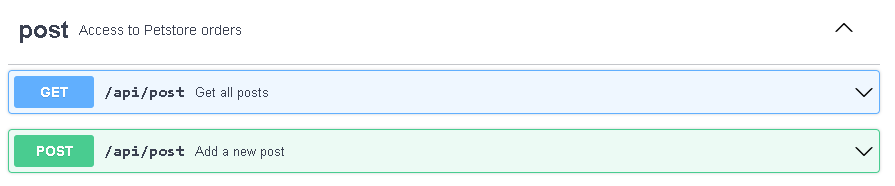
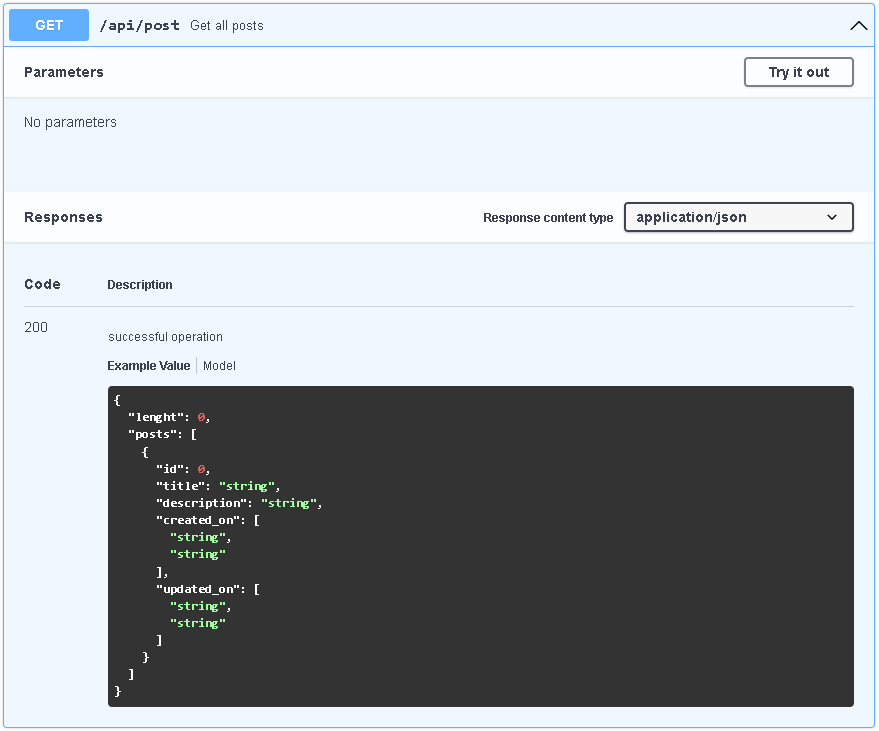
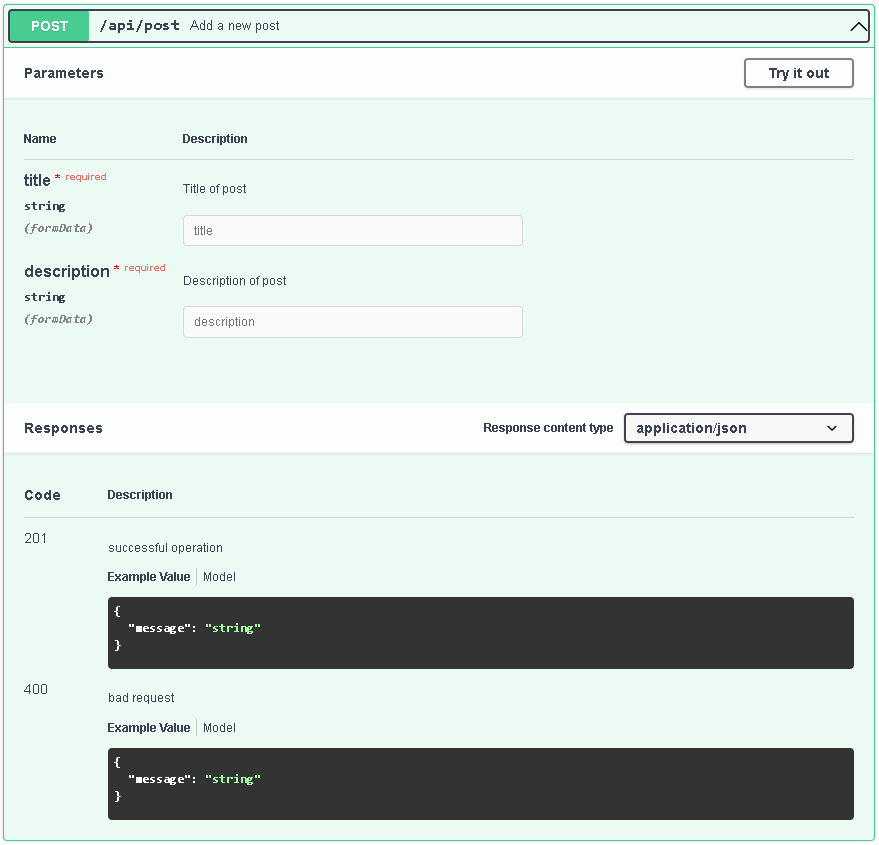

# Docker Task 2
## Hometask

Написать Dockerfile для backend который располагается в директории /lib_catalog(для сборки контейнера необходимо использовать файл /lib_catalog/requirements.txt), для работы backend необходим postgresql, т.е. необходимо собрать 2 контейнера:

* backend
* postgresql

Осуществить сетевые настройки, для работы связки backend и postgresql.

## Variables

Чтобы задать переменные необходимо создать в корне файл .env
```ENV
APP_PATH - Директория где будет располагаться приложение
APP_PORT - Порт на котором будет подыматься приложение
APP_MODE - Метод развёртывания production или development
POSTGRES_PASSWORD - Пароль для доступа к базе данных
COMPOSE_PROJECT_NAME - Наименование проекта
```
Пример .env файла
```ENV
APP_PATH=/app
APP_PORT=8080
APP_MODE=production
POSTGRES_PASSWORD=LOjihnrKISUd3did2d
COMPOSE_PROJECT_NAME=Lesson-02
```

## Api

### Swagger файл

[swagger.yaml](swagger.yaml)

### Список доступных методов



Описание GET доступа


Описание POST доступа
